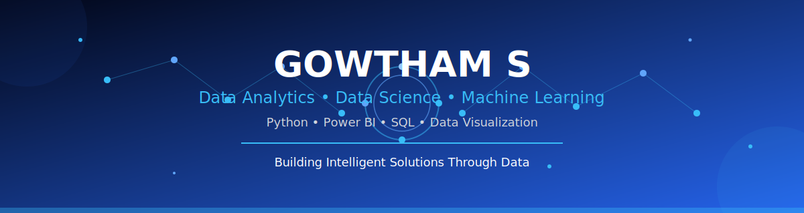

<div align="center">



# 👋 Hi, I'm Gowtham S

### Data Analytics • Data Science • Machine Learning


<br>

<a href="https://github.com/G0wth9m">

</a>

<a href="https://www.linkedin.com/in/gowtham-sud">

</a>

<a href="mailto:gowtham922006@gmail.com">

</a>


</div>

---

# 💫 About Me


🎓 BCA Graduate

📊 Passionate about **Data Analytics**, **Business Intelligence**, and **Data Science**

🐍 Learning **Python, SQL, Power BI, Machine Learning & AI**

📈 I enjoy turning raw data into meaningful insights through dashboards and visualizations.

🌍 Preparing for my **Master's Degree in Germany** while building projects and strengthening my technical skills.

💡 I believe consistency and curiosity are the keys to becoming a great data professional.

---

# 🚀 Current Focus

- 📊 Data Analytics
- 📈 Power BI Dashboard Development
- 🐍 Python Programming
- 🗄️ SQL & MySQL
- 🤖 Machine Learning
- 📉 Data Visualization
- ☁️ Cloud Computing
- 🇩🇪 German Language

---

# 🎯 Career Objective

> Transforming data into insights and insights into impactful decisions.

I am actively working towards becoming a skilled **Data Analyst / Data Scientist**, building projects using **Python, SQL, Power BI, and Machine Learning** while continuously improving my analytical thinking and problem-solving skills.

---

# 🌟 Fun Facts

✨ Love solving real-world problems using data

📚 Always learning new technologies

💻 Building projects to improve practical skills

🌍 Dreaming of studying and working in Germany

☕ Coffee + Music + Coding = Perfect Productivity

---
# 🛠️ Tech Stack

<div align="center">

### 👨‍💻 Programming Languages

<p>

</p>

### 📊 Data Analytics & Data Science

<p>


</p>

### ⚙️ Tools & Platforms

<p>

</p>

</div>

---

# 📈 Skills

| Skill | Level |
|-------|--------|
| Python | ⭐⭐⭐⭐☆ |
| SQL / MySQL | ⭐⭐⭐⭐☆ |
| Power BI | ⭐⭐⭐⭐☆ |
| Data Analytics | ⭐⭐⭐⭐☆ |
| Data Visualization | ⭐⭐⭐⭐☆ |
| Machine Learning | ⭐⭐⭐☆☆ |
| Problem Solving | ⭐⭐⭐⭐☆ |
| Communication | ⭐⭐⭐⭐☆ |

---

# 🚀 Featured Projects

### ✈️ Airline Delay Prediction

Machine Learning model that predicts airline delays using **Python, Pandas, Scikit-Learn, XGBoost, and Streamlit**.

**Tech Used**

- Python
- Pandas
- NumPy
- Scikit-Learn
- XGBoost
- Streamlit

---

### 📊 Power BI Dashboard

Interactive business dashboards featuring:

- KPI Analysis
- Sales Reports
- Dynamic Filters
- Business Intelligence Visualizations

---

### 🤖 Citizen AI

AI-powered citizen engagement platform built using modern technologies.

---

### 📈 Data Analytics Portfolio

Collection of Python, SQL, and Power BI projects focused on solving real-world business problems.

---

# 🏆 Certifications

- ✅ Google Responsible AI
- ✅ IBM Artificial Intelligence Fundamentals
- ✅ IBM Granite AI
- ✅ IBM Web Development Fundamentals
- ✅ NVIDIA AI Courses
- ✅ TCS iON Career Edge
- ✅ Tata GenAI Powered Data Analytics Job Simulation
- ✅ Deloitte Data Analytics Virtual Experience
- ✅ JPMorgan Software Engineering Job Simulation
- ✅ ANZ Cyber Security Virtual Experience

---

# 📚 Currently Learning

```text
🐍 Advanced Python

📊 Power BI

🗄️ Advanced SQL

🤖 Machine Learning

📈 Data Analytics

☁️ Cloud Computing

🇩🇪 German Language
```

---

# 🎯 2026 Goals

- 🚀 Build 20+ Data Analytics Projects
- 📊 Master Power BI
- 🐍 Become Advanced in Python
- 🗄️ Master SQL
- 🤖 Learn Deep Learning
- 🌍 Start Master's in Germany
- 💼 Secure a Data Analyst Role
- 🌟 Contribute to Open Source

---
# 📊 GitHub Statistics

<div align="center">


</div>

---

# 🔥 GitHub Streak

<div align="center">


</div>

---

# 📈 Contribution Graph

<div align="center">


</div>

---

# 🏆 GitHub Trophies

<div align="center">


</div>

---

# 📌 Featured Repository

<div align="center">

<a href="https://github.com/G0wth9m/airline-delay-prediction">

</a>

</div>

---

# 📅 GitHub Contribution Snake

<div align="center">


</div>

> **Note:** The snake animation will appear after setting up a GitHub Actions workflow.

---

# 📊 Coding Activity

```text
🐍 Python             ████████████████░░░░░   80%

🗄️ SQL / MySQL       ██████████████░░░░░░   75%

📊 Power BI          █████████████░░░░░░░   70%

🤖 Machine Learning  ███████████░░░░░░░░░   60%

☁️ Cloud             ████████░░░░░░░░░░░░   40%
```

---

# 💡 Quote

<div align="center">

> **"Without data, you're just another person with an opinion."**
>
> **— W. Edwards Deming**

</div>

---

# 🎯 Open Source Journey

🌱 Learning every day

🚀 Building useful projects

💻 Exploring Artificial Intelligence

📊 Improving Data Analytics skills

🤝 Looking forward to contributing to Open Source

---
# 🌐 Portfolio

### 🚀 GitHub
🔗 https://github.com/G0wth9m

### 💼 LinkedIn
🔗 https://www.linkedin.com/in/gowtham-sud

### 📧 Email
📩 gowtham922006@gmail.com

---

# 💻 Visitor Counter

<div align="center">


</div>

---

# 📫 Let's Connect

<div align="center">

<a href="mailto:gowtham922006@gmail.com">

</a>

<a href="https://www.linkedin.com/in/gowtham-sud">

</a>

<a href="https://github.com/G0wth9m">

</a>

</div>

---

<div align="center">


### ⭐ Thanks for visiting my profile!

*"Turning Data into Decisions • Building the Future with AI"*

</div>
